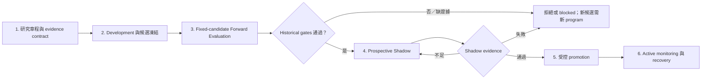

# 策略未來複製性研究流程

## 文件定位

本文件定義一套降低回測過度擬合、選擇偏誤、資料洩漏、成交落差與市場漂移的研究
流程。它不保證未來報酬等於歷史報酬，也不授權實際下單；repository 仍維持 dry-run
manual trading 邊界。

本文件區分三種規範層級：

- **現行契約**：Phase 6/7/8 已實作並可由 CLI 或 domain validator 強制驗證。
- **完整流程要求**：支持較強複製性結論所需的額外 evidence；尚無 schema 時必須明確記錄
  人工 artifact，不能假裝已由系統自動驗證。
- **Target-state**：需要程式或 schema 變更，完成前只能作為 roadmap。

現行正式路徑是高成本的 `strict_forward` profile：至少三個完整 development years、五個在
結果出現前登記的未來年度 evaluation folds，之後再累積至少 252 sessions 的 Shadow。從
plan registration 到最早 activation eligibility 通常至少約六年，也可能增加策略老化風險。

已看過結果的歷史 walk-forward 可以作診斷，但不能產生 Phase 6 `shadow-eligible`，也不能
重新命名為 prospective evidence。

## 規範用語

- **必須（MUST）**：未滿足便不得通過本文件所稱的完整流程。
- **開發資料（Development）**：可用於提出假說、調參與選定候選的資料。
- **Retrospective Diagnostic**：結果可能已被看過，只能用來除錯、理解敏感度與建立假說。
- **Forward Evaluation**：在第一個 outcome 前已凍結 candidate 與判定流程的未來資料。
- **Prospective Shadow**：Historical Screen 通過後才開始的非下單 paper-execution evidence。
- **Experiment Family**：共享研究假說，且其結果曾影響本次候選選擇的完整 trial 集合。
- **Trial**：一個 outcome-relevant semantic definition fingerprint。
- **Selected Candidate**：Development 結束後、Forward Evaluation 開始前凍結的唯一候選。

## 核心決策規則

1. **先選候選，再驗證候選**：Forward Evaluation 只能接受或拒絕 frozen candidate，不能
   看完結果後改選 runner-up。
2. **保留完整搜尋歷史**：刪除失敗結果、重新命名或只呈現冠軍，不會消除已發生的研究
   自由度。
3. **一個主要確認統計量**：其他 Sharpe、profit factor、regime 與 robustness 指標是風險
   限制或診斷，不得事後挑選成主要結論。
4. **Fail closed**：資料、定義、family、成本、benchmark 或 prospective evidence 不完整時，
   狀態只能是 `blocked` 或 `insufficient evidence`。
5. **Watch 不等於 evidence 缺失**：Watch 只表示 evidence 完整但接近不利邊界；缺失或樣本
   不足是 `inconclusive`，必須阻擋新進場。
6. **Lifecycle 與 health 分離**：Phase 7 lifecycle 和 Phase 8 Healthy/Watch/Paused overlay 是
   兩個維度；retirement 不是 drift health。

## 六階段流程



---

## 階段 1：研究章程與 evidence contract

研究章程分兩次凍結：

1. Development 開始前，凍結假說、資料邊界、evaluation 年份、trial budget、selection rule、
   成本與停止條件。
2. Development 結束後、第一個 Forward Evaluation outcome 前，填入 selected trial、baseline、
   frozen family universe、definition fingerprint、seeds 與全部正式門檻。

最少欄位如下：

```yaml
asset: SPY
experiment_family: example_family
assurance_profile: strict_forward
hypothesis: "可被反駁的 edge 假說"
economic_mechanism: "風險溢酬、行為偏誤、流動性或制度原因"

development_period: "YYYY-MM-DD/YYYY-MM-DD"
forward_evaluation_years: [2027, 2028, 2029, 2030, 2031]
development_selection_rule: canonical_base_net_sharpe_then_simplicity
primary_confirmatory_statistic: mean_base_net_daily_sleeve_return
trial_budget: 12

selected_trial_id: "Development 結束時填入"
selected_definition_fingerprint: "正式 plan registration 時填入"
family_baseline_trial_id: "與 selected trial 不同"
frozen_family_trial_ids:
  - "trial-id-1"
  - "trial-id-2"

maximum_holding_sessions: 5
execution_lag_sessions: 1
dependency_sessions: 6
embargo_sessions: 1
base_cost_policy: "凍結的 base 成本"
stress_cost_policy: "凍結的 adverse 成本"
maximum_stress_drawdown: 0.20

cash_policy: zero_return_cash
random_entry_quantile: 0.90
random_seed: 17
random_samples: 1000
family_test: circular_block_bootstrap_max_mean
family_alpha: 0.10
bootstrap_block_sessions: 20
bootstrap_repetitions: 1000

shadow_minimum_sessions: 252
shadow_minimum_fills: 12
shadow_activation_checkpoint: "YYYY-MM-DD"
data_evidence_grade: snapshot_reproducible
```

`assurance_profile` 與 `data_evidence_grade` 是研究治理欄位，不是現行 CLI enum；它們必須
出現在研究章程或等價 artifact 中。

### Data evidence grade

| Grade | 可以宣稱 | 不可以宣稱 |
| --- | --- | --- |
| `snapshot_reproducible` | 重現某次 full refresh 取得的完整資料 | 每個歷史 session 都使用當時原始 vintage |
| `vintage_point_in_time` | 每個 decision session 的 availability 與 revision vintage 可驗證 | 未保存 vintage 卻依名稱推定 point-in-time |

目前 Yahoo `auto_adjust=True` snapshot 只支持 `snapshot_reproducible`。Publication lag 只能證明
observation 何時可用，不能證明日後沒有修訂。Universe 會變動時，仍必須保存 point-in-time
constituents 並處理 survivorship bias。

### Data 與 execution guardrails

- 每個 signal session 有明確 cutoff；provider、series、adjustment、availability 與 revision
  policy 在結果前凍結。
- 缺漏 session、重複列、非有限值、公司行動或 snapshot identity 問題一律 fail closed。
- Snapshot 損壞時只能由同一 bundle 復原，不能用現在下載的資料冒充原 evidence。
- 研究與 followup 使用相同的 capital-constrained canonical sleeve、base/stress costs、entry／
  exit ordering、未成交處理與持有期。
- 不支援多部位或 pyramiding 的策略應標成 platform-incompatible，不能偷偷改成單部位後仍
  宣稱驗證原策略。

正式執行要求 `result status == valid`，且 plan 中每個 frozen family trial 都有完整 snapshot、
definition、runtime、cost 與 canonical evidence。任意新 discovered package 不屬於 frozen
family 時，不應成為此 plan 的無關阻擋條件。

相關契約：

- [Reproducibility Foundation](reproducibility.md)
- [Result validity and trial history](result-validity-and-trial-history.md)
- [Canonical strategy-sleeve execution](canonical-sleeve-execution.md)
- [Execution model rule](../.agents/rules/execution-model.md)

---

## 階段 2：Development 與候選凍結

Development 可提出假說、調整訊號／參數／exit rules、執行敏感度分析與只使用 Development
data 的 ephemeral diagnostics。不得讀取 Forward Evaluation／Shadow outcome 後再修改本次
candidate、刪除失敗 trial 或重新定義 family。

只在 Development data 上執行、且從未接觸正式 evaluation outcome 的 diagnostics，不需要
冒充 qualification evidence。但只要 definition 被送入正式 evaluation、可被替換成 candidate，
或其 evaluation outcome 影響決策，就必須成為 append-only registry 中的正式 trial。

在 Forward Evaluation 前必須完成：

- 依 frozen `development_selection_rule` 選出恰好一個 candidate；
- 選出一個不同的 formal family baseline；
- 凍結完整 family universe 與所有可被選成 candidate 的 robustness variants；
- 凍結只會一致套用、不可被選成 candidate 的 stress transforms。

Forward Evaluation 開始後若新結果啟發了另一個 candidate 或 selectable variant，原 plan 不能
原地擴充；必須建立新 trial、新 plan 與新 prospective program。達到 trial budget 仍無候選時，
正式結論是停止該 family，或以新假說與新 family identity 重新開始。

---

## 階段 3：Fixed-candidate Forward Evaluation

現行 Phase 6 是固定 candidate 的未來評估，不是每年重新選參數的 nested walk-forward。

### 時間結構

- 至少三個完整、連續 development years。
- 至少五個完整、連續、不重疊的未來年度 evaluation folds。
- Plan 在第一個 evaluation outcome 前建立。
- `dependency_sessions >= maximum holding + execution lag`。
- `embargo_sessions >= execution lag`。
- 現行 purge／embargo 實際是 fold-edge signal exclusions：開頭排除 embargo sessions，結尾
  排除無法在 fold 內完成 exit 的 dependency sessions；它們不是一般 cross-validation 對
  training labels 的 purge。
- Trade 歸屬 signal date 所在 fold，exit 完整落在同一 fold。
- Zero-signal folds 保留為明確 evidence。

若策略會自動重訓，rolling／expanding window、特徵可用時間、演算法與更新頻率都必須屬於
frozen definition。相鄰年度 folds 是同一市場時間序列的分段，不是五個統計獨立實驗。

### Fold 與 continuous path

現行 Phase 6 每年以相同 initial capital 重建 isolated sleeve，再 compound fold returns；stress
drawdown 也是最差的單一 fold drawdown。它不能量到跨年持倉、跨年 drawdown 或完整
time-under-water。

完整流程應附一條不在年界重設資本的 continuous canonical sleeve report，annual folds 只作
歸因。這尚未成為正式 schema；缺少它時只能宣稱通過 repository core，不能宣稱跨年風險已
完整驗證。

### 現行 Historical Stability Screen

| 指標 | 門檻 |
| --- | ---: |
| 完成交易 | 至少 20 筆 |
| 有交易 folds | 至少 3 個 |
| 正報酬 traded folds | 至少 60% |
| Base compounded return / profit factor | `> 0` / `> 1.1` |
| Stress compounded return / profit factor | `> 0` / `> 1.0` |
| Stress drawdown | 不突破 frozen risk limit |
| Fold 集中度 | 任一 fold 不超過 50% trades 或 gross profit |

Zero-signal folds 會保存，但現行 `positive_traded_fold_rate` 的分母只包含 traded folds。若假說
預期每年最低 signal rate，必須另設 signal-coverage gate。Profit factor、positive return 與
zero-return cash 高度重疊，只是資格條件，不是多份獨立統計證據。

### Benchmarks

1. **Zero-return cash**：現行 cash 固定為 0，與 `base return > 0` 是同一條件，只報告一次。
2. **Family baseline**：candidate cumulative return 必須高於 frozen distinct baseline trial。
3. **Random entry**：candidate cumulative return 必須高於 1,000 random paths 的第 90 percentile。

現行 random matcher 保留月份、entry lag、已實現 holding、fold 與 completed-trade count。這只
對 fixed-hold／expiry strategy 有清楚 null。Dynamic target、stop 或 trailing exit 的 realized
holding 已包含 outcome information；完整流程必須隨機化 signal 後重新執行 frozen exit rules、
sleeve occupancy 與未成交處理。現行 evaluator 尚未支援，只有現行 matcher 時必須標成
`limited-null`，不能用它支持完整 timing-edge 結論。

### Robustness

- Parameter neighborhood、signal delay、missed fill、cost、regime 與 placebo 全部預先數值化。
- 「合理的小幅惡化」、「平台」或「單一 regime 支撐」不能單獨作為 gate。
- Forward Evaluation 後只允許執行已凍結、不可被選成 candidate 的 stress transforms。
- 若結果促成新 candidate／trial，原 plan 不得吸收它，必須開新 prospective program。
- Crisis-only 等策略可以只在 declared regime 取得 edge；若聲稱跨資產，資產集合也要預先
  凍結並完整呈現。

### Final family-wise adjustment

Family adjustment 在所有 frozen benchmark 與 robustness evidence 完成後最後執行：

- 使用 frozen family universe 中全部正式 trials 的相同 evaluation sessions；
- 現行 test statistic 是 selected candidate 的 mean base-net daily return；
- null 是每次 circular block resample 的 family maximum centered mean；
- 預設 20-session blocks、1,000 repetitions；
- 現行 `adjusted_confidence >= 0.90` 應解讀為 family-wise adjusted p-value `<= 0.10`，不是
  「策略有 90% 機率為真」；
- 缺 trial、duplicate／shifted sessions、non-finite return 或不完整 history 一律 blocked。

這個 gate 不重新排名。其他 trial 即使表現較好，也不能取代 frozen candidate。20-session
block 是預註冊 policy，不是自然常數；可報告 block-length sensitivity，但不得事後換正式值。

DSR、PBO、White Reality Check 或 Hansen SPA 不需要全部堆成 hard gates。研究章程只指定一個
正式 family test，其餘作 diagnostic；若使用 PBO，winner statistic 必須與實際 Development
selection rule 相同。

Legacy history 不完整時，現行 `ForwardSelectionEpoch` 會凍結 selected trial、baseline 與
family universe；同 family 新增 trial 會使 open epoch 失效。以 `epoch_id` 隔離下一代研究、
避免自動摧毀 fixed-candidate program，是尚未實作的 target-state。

### Historical decision

- 全部現行 gates 通過：`shadow-eligible`。
- 任一 hard gate 失敗：`historical-screen-failed`。
- Evidence 不完整或不可驗證：`blocked`。

失敗後不得換 runner-up；任何新 candidate 都要新 plan 與新 prospective program。

相關契約：

- [Historical qualification and prospective Shadow](historical-qualification-and-shadow.md)
- [ADR 0022 — Trial registry](adr/0022-append-only-experiment-trial-registry.md)
- [ADR 0023 — Family-wise bootstrap](adr/0023-family-wise-block-bootstrap-for-selection-bias.md)
- [ADR 0024 — Benchmarks](adr/0024-three-benchmarks-for-signal-qualification.md)

---

## 階段 4：Prospective Shadow

同一 prospective program 只能有一個 frozen candidate。Shadow registration 綁定 exact
Historical Screen、trial、definition snapshot、cost policies、prospective start、activation
checkpoint 與 activation policy。

### 現行最低 evidence

- 至少 252 completed sessions 與 12 completed simulated fills；
- base/stress return `> 0`、base/stress profit factor `> 1`；
- stress drawdown 不突破 frozen limit；
- critical-drift assessment 通過；
- data、proposal、fill 與 cutoff evidence 完整且單調前進。

252 sessions／12 fills 是操作下限，不代表充分 power。完整流程應另報 PSR／Minimum Track
Record Length 或等價樣本需求；在統一 schema 完成前它是人工 artifact，不得冒充 CLI gate。

- 未達樣本需求：`insufficient evidence`，繼續 Shadow，不能降低門檻。
- Evidence 缺漏、definition mismatch 或 cutoff 不單調：`blocked`。
- Hard economic/risk gate 失敗：不通過；不得原地調參。
- 全部通過：`activation-eligible`，但仍不是 Active，也未授權下單。

不得跳過交易、回填較早 evidence、改 provider policy，或在 exit outcome 出現後重寫 proposal。
Outcome-relevant change 必須建立新 trial、新 Shadow identity，且 evidence 歸零。

---

## 階段 5：受控 promotion

Shadow → Active promotion 和 Active 後每筆 BUY authorization 是不同邊界。

### Promotion 前置條件

- Exact activation evaluation 為 `activation-eligible`。
- Historical Screen、Shadow、definition、result 與 parity identities 精確匹配。
- Current persisted result 仍為 `valid`。
- `PredictiveDriftEnvelope` 已從 exact passing Historical Screen 與 Shadow evidence 建立、驗證並
  在 Active 前凍結。
- 同 ticker 的既有 Active strategy 已依 replacement／retirement 契約處理。

成功 promotion 後 lifecycle 才成為 Active；「strategy 已 Active」不是 promotion 前置條件。

### 每筆 BUY authorization

- Lifecycle 為 Active，global no-new-entry 關閉，Active proof/current result 有效。
- Data bundle 等於最新 completed session，cutoff 與 identity 可驗證。
- Ledger、broker reconciliation、allocation epoch 與 sleeve occupancy 全部通過。
- Drift binding 有效、health 不是 Paused、沒有 hard guard。
- Latest assessment 若是 `inconclusive`，即使現行 health 投影為 Watch，也必須另外維持 global
  no-new-entry，才符合本文件的 fail-closed 規則。

相關契約：[Controlled followup cutover](controlled-followup-cutover.md)。

---

## 階段 6：Active monitoring 與 recovery

### 兩個狀態維度

| 維度 | 狀態 | 說明 |
| --- | --- | --- |
| Phase 7 lifecycle | Shadow / Active / Retiring / lifecycle Paused | 決定 qualification、ownership 與 entry authority |
| Phase 8 health | Healthy / Watch / Paused | 只描述 Active strategy 的 drift health |

Retirement completion 是 Phase 7 event，不是 Phase 8 的 `Retired` health state。

| Health | 新進場 | 既有部位 |
| --- | --- | --- |
| Healthy | 其他 Phase 7 guards 通過才允許 | 正常管理 |
| Watch | 只限 evidence 完整的 borderline metric；依 frozen policy 處理 | 正常管理 |
| Paused | 一律阻擋 | 繼續 verified target/stop/expiry 管理 |

現行 drift engine 會把第一次 inconclusive checkpoint 投影為 Watch、第二次投影為 Paused，而
authorizer 對第一次 Watch 仍可能允許 BUY。完整流程必須在 inconclusive 時以 global
no-new-entry 補足，直到有獨立 blocking state。

現行 `PredictiveDriftEnvelope` 可保存 metric boundaries、minimum samples、windows、checkpoint
schedule 與 hard guards，但沒有自動推導 joint false-alarm rate。個別 metric 的 20%／5%
quantile 不代表多 metrics、多 checkpoints 下的全域 20%／5%；overlapping windows 下連續兩次
Watch 也不是兩份獨立 evidence。

Target-state 應在 Shadow 前凍結一份 joint `ReplicationAndDriftSpec`，同時處理 within-range
雙尾、family-wise metrics、sequential checkpoints 與 window dependence。若仍用 Shadow 校準
Active envelope，應分開 calibration／confirmation evidence，避免同一資料既驗證又放寬邊界。

Recovery 必須由追加 evidence 推導，不能編輯 state 或 threshold。Definition 改變時重走完整
qualification；Paused 不阻擋 verified existing-position exit management。

相關契約：[Live drift and recovery](live-drift-and-recovery.md)。

---

## 統一判定邏輯

```text
DEVELOP on Development data only
SELECT exactly one candidate and FREEZE family, baseline, sessions, costs, tests, and thresholds

REQUIRE exact valid evidence for every frozen family trial
RUN fixed-candidate folds, frozen benchmarks, and preregistered non-selectable robustness transforms
RUN the frozen family-wise test last

hard-gate failure => REJECT; runner-up substitution forbidden
missing evidence => BLOCK
all historical gates pass => REGISTER exactly one Shadow

Shadow sample insufficient => CONTINUE SHADOW; block new entry
Shadow hard-gate failure => REJECT; changed candidate requires new program
Shadow pass => ACTIVATION-ELIGIBLE

FREEZE PredictiveDriftEnvelope and PROMOTE through Phase 7
WHILE Active:
    authorize every BUY from current result/data/ledger/epoch/drift evidence
    inconclusive evidence => global no-new-entry
    drift Pause or hard guard => block new entry
```

## 稽核清單

- [ ] Charter、假說、Development boundary、selection rule 與 trial budget。
- [ ] Selected candidate、baseline、frozen family universe 與完整 trial history。
- [ ] Data evidence grade、snapshot、cutoff、definition 與 runtime identity。
- [ ] Base/stress isolated-fold evidence；continuous sleeve report 或明確未執行狀態。
- [ ] Cash、baseline、random benchmark；dynamic-exit strategy 的 null 限制。
- [ ] Frozen robustness protocol 與全部結果。
- [ ] Final family-wise adjusted p-value；DSR/PBO 等 diagnostic 狀態。
- [ ] Shadow registration、activation policy、proposals、fills、PSR/MTRL 狀態。
- [ ] Activation、result、parity、PredictiveDriftEnvelope identities。
- [ ] Inconclusive 對應 no-new-entry、pause、recovery 與 retirement logs。

缺少必要 artifact 時不得以口頭結論或舊報告代替。尚未實作的 artifact 必須標成未執行，
不能因 checklist 有欄位就宣稱已自動驗證。

## 現有能力與已知缺口

| 能力 | 現況 | 限制 |
| --- | --- | --- |
| Snapshot、definition、validity、trial registry | 已實作 | Snapshot reproducibility 不等於 true revision vintage |
| Five-fold fixed-candidate screen | 已實作 | Annual sleeves 重設 capital；通常需等五年 |
| Three benchmarks | 已實作 | Cash 為 0；dynamic-exit random matcher 是 limited null |
| Max-mean family bootstrap | 已實作 | `confidence >= .90` 應解讀為 adjusted p-value `<= .10` |
| Prospective Shadow | 已實作 | 252 sessions／12 fills 是最低操作門檻 |
| Activation 與 per-BUY guards | 已實作為 dry-run | Promotion 與 order authorization 不可混用 |
| Predictive drift | 已實作為 evidence layer | 無 joint/sequential false-alarm calibration |
| Continuous cross-fold path | 尚未 formalize | 目前需人工 report |
| True point-in-time revision vintage | 尚未實作 | Yahoo full refresh 不支持此 claim |
| Dynamic-exit random re-execution | 尚未實作 | 目前不能完整隔離 timing edge |
| DSR/PBO/PSR/MTRL、統一 robustness schema | 尚未 formalize | 記錄人工 artifact 或未執行狀態 |
| Inconclusive 專用 blocking state | 尚未實作 | 目前以 global no-new-entry 補足 |
| Joint pre-Shadow ReplicationAndDriftSpec | Target-state | 完成前沿用 Phase 6 policy + Phase 8 envelope |

`trading-evaluate-best` 只能作 Development 診斷與候選摘要，不能在 Forward Evaluation 後重新
選 champion。正式晉級權威是 frozen candidate 的 Phase 6/7/8 verified lifecycle evidence，
加上本文件明確列出的人工完整流程 artifacts。

## 解讀限制

- 通過代表目前 evidence 與預先設定的失效風險相容，不保證未來獲利。
- Forward Evaluation folds 是相鄰時間區段，不是獨立重複實驗。
- Snapshot reproducibility、publication as-of 與 true revision vintage 是三件不同的事。
- 結構斷裂、制度改變、擁擠、下市與流動性消失仍可能讓歷史分布失效。
- 低頻策略需要更長時間；交易不足只能解讀為 insufficient evidence。

## 方法參考

- Halbert White, [A Reality Check for Data Snooping](https://doi.org/10.1111/1468-0262.00152).
- David H. Bailey and Marcos López de Prado,
  [The Deflated Sharpe Ratio](https://papers.ssrn.com/sol3/papers.cfm?abstract_id=2460551).
- David H. Bailey, Jonathan M. Borwein, Marcos López de Prado, and Qiji Jim Zhu,
  [The Probability of Backtest Overfitting](https://doi.org/10.21314/JCF.2016.322).
