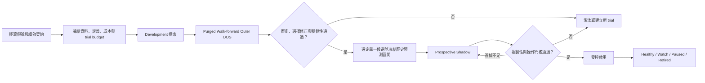

# 策略未來複製性研究流程

## 文件定位

本文件定義一套用來降低回測過度擬合、選擇偏誤、資料洩漏、成交落差與市場狀態漂移的
策略研究流程。目標不是保證未來報酬等於歷史報酬，而是：

1. 讓所有正式結論都來自可重現、未被選擇性省略的證據；
2. 在看見評估結果前，先凍結策略、資料、成本、比較方式與淘汰門檻；
3. 用多個獨立時間區段、完整策略家族與真正的未來資料估計泛化能力；
4. 把「未來表現相似」定義成一個可檢驗的預測區間，而不是主觀感受；
5. 在上線後持續偵測漂移，於證據惡化時停止新進場。

本文件是研究與晉級規範，不授權實際下單，也不取代人工風險決策。現有系統仍維持
dry-run manual trading 邊界。

## 規範用語

- **必須（MUST）**：未滿足便不得晉級。
- **應該（SHOULD）**：原則上必須採用；偏離時要在預註冊文件中說明原因。
- **建議（RECOMMENDED）**：保守研究配置，可依策略頻率與風險需求預先調整。
- **開發資料（Development）**：可用於提出假說、選擇特徵與調整參數的資料。
- **外層樣本外資料（Outer OOS）**：只能依預先凍結的流程評估，不得回頭調整策略。
- **策略家族（Experiment Family）**：共享一個研究假說、且彼此存在選擇關係的完整 trial
  集合。
- **Trial**：一個 outcome-relevant semantic definition fingerprint。參數、訊號、成交或風險
  規則的實質變更都形成新 trial。
- **Historical Replication Envelope**：只由歷史 Outer OOS 證據建立、在 Shadow 開始前凍結
  的未來表現預測區間。
- **Predictive Drift Envelope**：策略通過 Shadow 後，依預註冊方法用合格歷史與 Shadow
  證據建立、在 Active 前凍結的持續監控區間。

## 核心原則

### 不把「最好回測」當成「最可能複製」

候選策略越多，最高的回測績效越可能只是幸運極值。正式研究必須保留所有嘗試，並依
完整策略家族修正 selection bias。刪除失敗結果、重新命名策略或只呈現冠軍，都不能消除
已經發生的研究自由度。

### 不把曾經看過的歷史資料重新稱為未見資料

Walk-forward 可以檢查時間穩定性，但若研究者已反覆看過那些年份，它仍不是純粹的
prospective evidence。真正未污染的驗證從預先登記的 Forward Selection Epoch 或 Shadow
開始。想提高保證程度，最重要的成本是等待新資料，而不是增加回測次數。

### 不要求未來精確複製單一歷史點估計

市場報酬有高度雜訊。研究應預測一個分布，並判斷新證據是否仍在合理範圍內。單一勝率、
累計報酬或 Sharpe 點估計都不足以代表複製性。

### Fail closed

資料、定義、trial history、成本證據、benchmark 或 prospective evidence 只要不完整，狀態
就是 `blocked` 或 `insufficient evidence`，不得以人工推測補齊或降級門檻。

## 全流程



---

## Gate 0：研究問題與績效契約

正式測試前必須建立研究章程，至少包含：

```yaml
asset: SPY
experiment_family: example_family
hypothesis: "策略為何可能取得非隨機、可持續的 edge"
economic_mechanism: "風險溢酬、行為偏誤、流動性或制度原因"
decision_horizon_sessions: 252
maximum_holding_sessions: 5
execution_lag_sessions: 1
development_period: "YYYY-MM-DD/YYYY-MM-DD"
outer_evaluation_folds:
  - "YYYY"
  - "YYYY"
primary_metric: base_net_excess_sharpe
ranking_metric: lower_confidence_bound_90
hard_risk_budget:
  maximum_stress_drawdown: "預先設定"
trial_budget: "預先設定的最大正式 trial 數"
benchmarks:
  - cash
  - preregistered_family_baseline
  - exposure_matched_random_entry
base_cost_policy: "凍結的 base 成本"
stress_cost_policy: "嚴格較差的 stress 成本"
selection_adjustment: family_wise_block_bootstrap
shadow_minimum_sessions: 252
shadow_minimum_fills: 12
```

研究假說必須說明策略可能持續存在的經濟原因。純粹由價格圖形搜尋得到、但沒有可反駁
機制的策略可以探索，卻需要更嚴格的 selection adjustment 與 prospective evidence。

### Gate 0 通過條件

- 所有欄位在第一個正式 OOS 結果出現前凍結。
- 成功、失敗與停止條件均已定義。
- 定義何種修改必須建立新 trial。
- 沒有依已知 OOS 結果反推門檻。

---

## Gate 1：資料、時間與成交有效性

### 資料要求

- 使用 point-in-time 可得的資料；不得使用未來修訂值或未來才能知道的成分名單。
- 每個 signal session 必須有明確 data cutoff。
- 輔助資料依實際發布時間做 as-of alignment，並凍結 publication lag。
- 價格調整、公司行動、缺漏 session、重複列與非有限值必須 fail closed。
- 若研究 universe 會變動，必須處理 survivorship bias；固定單一 ticker 也要保存其歷史身份與
  corporate-action 證據。
- Immutable snapshot 損壞時只能由同一 bundle 復原，不能用現在下載的資料冒充歷史證據。

### 成交要求

- 研究與 followup 必須使用同一個 capital-constrained canonical sleeve。
- 每個 sleeve 最多一個部位；不可用獨立複利的重疊交易放大曝險。
- 凍結進出場順序、隔日成交、未成交處理、滑價、費用與持有期。
- 同一 candidate stream 必須同時產生 gross、base-net 與 stress-net daily equity。
- 正式排名與資格必須使用 canonical daily-equity metrics，不能退回 legacy Part A/B/C 指標。

### Gate 1 通過條件

- `result status` 精確為 `valid`。
- Snapshot、definition fingerprint、runtime、成本與 canonical evidence 完整可重現。
- 任一 discovered family candidate 不完整時，不得做 partial ranking。

相關契約：

- [Reproducibility Foundation](reproducibility.md)
- [Result validity and trial history](result-validity-and-trial-history.md)
- [Canonical strategy-sleeve execution](canonical-sleeve-execution.md)
- [Execution model rule](../.agents/rules/execution-model.md)

---

## Gate 2：Development 探索

開發階段可以：

- 提出或拒絕假說；
- 選擇訊號、參數與退出規則；
- 進行錯誤診斷與敏感度探索；
- 執行不寫入 qualification evidence 的 ephemeral diagnostics。

開發階段不得：

- 把 Outer OOS 或 Shadow 結果拿回來調整同一 trial；
- 刪除失敗 trial 以降低多重測試數量；
- 在看到結果後重新定義策略家族；
- 將報告格式變更以外的 outcome-relevant 修改視為同一 definition。

所有正式 trial 都必須寫入 append-only registry。重跑相同 definition 是新 observation；修改
definition 則是新 trial。達到預註冊 trial budget 後，若仍無候選通過，研究家族應停止，或以
新的假說與新的 prospective program 重新開始。

---

## Gate 3：Purged Walk-forward Outer OOS

### 最低結構

- 至少三個完整且連續的 development years。
- 至少五個完整、連續、不重疊的年度 evaluation folds。
- Purge 必須覆蓋 `maximum holding + execution dependency`。
- Embargo 必須覆蓋 execution lag。
- 交易歸屬於 signal date 所在 fold，exit 必須完整落在該 fold 可評估範圍內。
- Zero-signal folds 必須保留，不能從穩定性分母中消失。

如果模型會定期重訓，研究必須凍結「重訓演算法」與可使用的歷史範圍。每個 fold 只能使用
當時已知的資料重新估計，不能人工選擇該年度最佳參數。

重疊 rolling windows 可以做診斷，但不得把同一交易重複計算成多份資格證據。

### 歷史穩定性最低門檻

| 指標 | 必須通過的門檻 |
| --- | ---: |
| 完成交易 | 至少 20 筆 |
| 有交易 folds | 至少 3 個 |
| 正報酬 traded folds | 至少 60% |
| Base compounded return | `> 0` |
| Base profit factor | `> 1.1` |
| Stress compounded return | `> 0` |
| Stress profit factor | `> 1.0` |
| Stress drawdown | 不得突破預註冊風險上限 |
| Fold 集中度 | 任一 fold 不得占超過 50% 交易或獲利 |

以上是最低資格，不是排名分數。某策略即使累計報酬最高，只要一個硬門檻失敗便不得晉級。

相關契約：[Historical qualification and prospective Shadow](historical-qualification-and-shadow.md)。

---

## Gate 4：Benchmark 與 selection-bias 修正

### 三個必要 benchmark

候選策略必須同時對照：

1. **Cash**：確認絕對資本成長不是負值。
2. **Preregistered family baseline**：確認複雜化後確實改善原始策略。
3. **Exposure-matched random entries**：保留月份、holding、lag、fold 與交易數，只移除擇時
   訊息，確認 edge 不只是市場曝險或幸運進場。

Buy-and-hold 可以作為描述性參考，但對低曝險事件型策略，不應取代 exposure-matched
benchmark。

### 完整 family 修正

- Family-wise block bootstrap 必須包含所有正式 trial，包括失敗、移除與落後版本。
- 每個 trial 必須提供相同 session identities 的 dated daily excess returns。
- 預設可使用 20-session blocks 與 1,000 repetitions；若變更，必須事前凍結。
- 至少達到 90% selection-adjusted confidence，才可通過現有 Phase 6 family gate。
- Duplicate、缺漏、session 位移、non-finite return 或不完整 legacy selection history 都會阻擋
  retrospective qualification。

### 保守研究配置的額外診斷

下列項目目前不是全部由 repository CLI 強制執行，但對高保證流程應加入：

- **Deflated Sharpe Ratio（DSR）≥ 95%**：修正 trial 數、樣本長度、偏態與峰態後，仍有足夠
  證據高於基準 Sharpe。
- **Probability of Backtest Overfitting（PBO）≤ 10%**：用 CSCV 評估家族內冠軍到了 OOS
  反而落後的風險。
- 視策略家族特性加入 White Reality Check 或 Hansen SPA；不得在看過結果後選擇最有利的
  顯著性檢定。

若歷史 selection history 已經不完整，不能假裝補齊。必須在第一個未來結果前建立新的
`ForwardSelectionEpoch`，凍結 candidate、baseline 與完整 family universe。

參考決策：

- [ADR 0022 — Append-only experiment trial registry](adr/0022-append-only-experiment-trial-registry.md)
- [ADR 0023 — Family-wise block bootstrap](adr/0023-family-wise-block-bootstrap-for-selection-bias.md)
- [ADR 0024 — Three benchmarks](adr/0024-three-benchmarks-for-signal-qualification.md)

---

## Gate 5：破壞性穩健測試

穩健測試必須在規格中預先列出，且其變體仍計入 trial 或明確凍結為同一 robustness protocol。

### 參數地形

- 對核心連續參數測試預註冊的鄰近網格，例如基準值上下 10% 與 20%。
- 績效應形成可辨識的平台，而不是只有一個孤立尖峰。
- 建議至少 70% 鄰近組合仍維持 stress-net 正報酬與未突破風險預算。
- 鄰近組合的結果不得用來事後換選另一個冠軍；若要換選，必須建立新 trial 並重新修正選擇
  偏誤。

### 時間與成交擾動

- Signal 或 entry 向後延遲一個 session。
- 模擬漏單、較差 fill 與既有 stress cost policy。
- 檢查 warmup、fold boundary、同日 entry/exit 與 open-position mark-to-market。
- 任何合理的小幅成交惡化都讓 edge 消失時，策略不得晉級。

### 市場狀態

- 事前定義 bull/bear、高低波動、利率或流動性狀態。
- 每個狀態都報告樣本量、曝險、報酬與回撤，不只呈現通過的區段。
- 不要求每種 regime 都正報酬，但策略必須符合預註冊的適用範圍，且不可由單一 regime 支撐
  全部結果。

### Placebo 與外部複製

- Random-entry benchmark 與 signal-date shift 是必要 placebo。
- 若假說聲稱跨資產普遍性，必須在相關資產上不重新調參地驗證方向一致性。
- 若假說只適用特定資產，跨資產失敗是診斷資訊，不應事後改寫成普遍假說。

### Gate 5 通過條件

- 所有預註冊 hard robustness tests 通過。
- 沒有單一合理擾動立即消滅策略 edge。
- 參數地形不是孤立尖峰。
- 所有結果完整呈現且納入 selection history。

---

## Gate 6：選擇單一候選與建立歷史預測區間

### 選擇順序

只有通過 Gate 1 至 Gate 5 的候選可以排名。建議選擇規則如下：

1. 最大化 `90% lower confidence bound of base-net excess Sharpe`；
2. 比較 stress-net 報酬與 stress drawdown；
3. 比較跨 folds 與參數鄰域的穩定性；
4. 若證據接近，選參數較少、換手率較低、機制較簡單的策略。

不應以單一 Part B 累計報酬、勝率或未修正 Sharpe 直接選冠軍。若沒有候選通過全部 hard
gates，正式結論就是「沒有合格策略」。

### Historical Replication Envelope

選定單一候選後，使用固定演算法從 Outer OOS daily-equity paths 建立一個 252-session
預測區間。這個 envelope 必須在 Shadow 開始前凍結並記錄：

- strategy ID 與 definition fingerprint；
- historical plan、fold 與 family-selection evidence IDs；
- bootstrap seed、block length、repetitions 與 horizon；
- metric families、最低樣本與 checkpoint schedule；
- 每個 metric 的 Normal、Watch 與 Pause 邊界；
- 不依分位數放寬的 hard economic/risk floors。

建議 metric families：

| Family | Higher/lower is better | 主要指標 |
| --- | --- | --- |
| Performance | Higher | base/stress net return、excess Sharpe、profit factor |
| Signal | Within range | signal/fill count、win rate、平均 holding |
| Risk | Lower | drawdown、tail loss、time under water |
| Execution | Lower | slippage、unfilled rate、fees、execution lag |
| Portfolio | Within/lower | utilization、turnover、concentration |

對 higher-is-better 指標：

- adverse 20th percentile 為 `Watch`；
- adverse 5th percentile 為 `Pause`。

對 lower-is-better 指標：

- adverse 80th percentile 為 `Watch`；
- adverse 95th percentile 為 `Pause`。

若 bootstrap 不能產生穩定區間，或有效樣本不足，候選只能標記為 `insufficient evidence`。

---

## Gate 7：Prospective Shadow

Shadow 是第一層真正未見資料的複製測試。只能有 Gate 6 選定的單一 frozen candidate 進入
同一 prospective program；不得同時觀察多個 Shadow 後再挑最好者。

### 最低證據

- 至少 252 個完成的交易 sessions。
- 至少 12 個完成的 simulated fills。
- Base 與 stress return 都為正。
- Base 與 stress profit factor 都大於 1。
- Stress drawdown 未突破預註冊風險上限。
- 資料、proposal、fill 與 cutoff evidence 完整且單調前進。

固定的 252 sessions 與 12 fills 只是最低操作門檻。保守流程還必須達到由
Probabilistic Sharpe Ratio／Minimum Track Record Length 或等價方法推導的樣本需求。低頻策略
若未累積足夠證據，只能繼續 Shadow，不能降低門檻。

### 與歷史預測區間比較

- 每個預註冊 checkpoint 都以 frozen Historical Replication Envelope 分類。
- 一次 Watch 表示延長觀察與加強診斷，不立即認定失效。
- 任一 hard guard 或 adverse 5% Pause boundary 表示 Shadow 不通過。
- 連續兩個 scheduled checkpoints 為 Watch，視為持續性漂移，不得晉級。
- 晉級前最後兩個 scheduled checkpoints 應為 Normal。

### 禁止事項

- 不得改參數、跳過不喜歡的交易、改資料 provider 或回填較早的 Shadow evidence。
- 不得在 exit outcome 出現後重寫 proposal terms。
- Outcome-relevant definition change 必須建立新 trial、新 Shadow identity，且證據歸零。

Shadow 通過只代表 `activation-eligible`，不代表已授權實際下單。

---

## Gate 8：受控啟用與持續漂移控制

通過 Shadow 後，使用預先凍結的 derivation policy，從合格歷史 folds 與 Shadow evidence 建立
`PredictiveDriftEnvelope`。Envelope 必須在 Active 前凍結，並綁定通過資格時使用的精確
historical、Shadow、definition 與 result identities。

### 啟用條件

- Exact strategy 為 Active，且沒有 global no-new-entry。
- Current result 仍為 `valid`。
- Data bundle 等於最新完成 session，identity 可驗證。
- Ledger 與 broker reconciliation 通過。
- Allocation epoch 正確，且 sleeve 沒有實際部位或占用中的 entry proposal。
- Drift envelope 已綁定，狀態不是 Paused，且沒有 hard guard。

若將流程連接到真實資金，初始風險配置必須事前設定且顯著小於目標配置；只有在預定
checkpoint 通過後才可擴大。不得因近期正報酬臨時提前加碼。Repository 現況仍是 dry-run
manual trading，本條是研究治理要求，不表示系統已實作 broker live cutover。

### Drift 狀態

| 狀態 | 意義 | 新進場 | 既有部位 |
| --- | --- | --- | --- |
| Healthy | 所有 scheduled metrics 正常且無 hard guard | 其他 guards 也通過時才允許 | 正常管理 |
| Watch | 指標進入 adverse 20% 或證據暫時不足 | 加強監控，仍受其他 guards 限制 | 正常管理 |
| Paused | adverse 5%、hard guard 或連續兩次 Watch | 一律阻擋 | 繼續驗證後的 target/stop/expiry 管理 |
| Retired | 經正式決策停止策略 | 一律阻擋 | 平倉前仍保留原策略 ownership |

恢復必須由追加的新證據推導，不能直接編輯狀態或門檻。正常 performance pause 至少需要新
Shadow sessions、完成交易、清除 hard guards 與連續正常 checkpoints；策略規則若改變則重走
完整資格流程。

相關契約：

- [Controlled followup cutover](controlled-followup-cutover.md)
- [Live drift and recovery](live-drift-and-recovery.md)

---

## 統一判定邏輯

```text
IF 任一 discovered candidate 不是 valid:
    BLOCK，禁止 partial ranking

FOR 每個 registered family trial:
    使用相同 immutable sessions 與 canonical sleeve 重算

IF selected candidate 未通過歷史硬門檻、三個 benchmarks、
   family-wise selection adjustment 或 robustness protocol:
    REJECT

SELECT 在全部合格候選中具有最佳保守下界者
FREEZE selected definition 與 Historical Replication Envelope

IF Shadow 未達最低 sessions 或統計樣本需求:
    INSUFFICIENT EVIDENCE，繼續觀察

IF Shadow 突破 hard floor、Pause boundary 或持續 Watch:
    REJECT；不得原地調參

IF Shadow 通過且所有 activation guards 通過:
    ACTIVATION-ELIGIBLE

WHILE Active:
    依 frozen Predictive Drift Envelope 定期重算
    hard guard / adverse 5% / persistent Watch => PAUSED
```

## 研究輸出與稽核清單

每個晉級決策至少要能追溯下列 artifacts：

- [ ] 研究章程與經濟假說。
- [ ] Immutable data snapshot 與 data cutoff。
- [ ] Exact definition snapshot 與 semantic fingerprint。
- [ ] 完整 append-only trial family history。
- [ ] Historical qualification plan 與 annual fold evidence。
- [ ] Base/stress canonical sleeve daily equity。
- [ ] Cash、family baseline、random-entry benchmark evidence。
- [ ] Family-wise selection-adjusted bootstrap evidence。
- [ ] DSR/PBO 或其明確未執行狀態。
- [ ] Parameter、execution、regime 與 placebo robustness report。
- [ ] Frozen Historical Replication Envelope。
- [ ] Shadow registration、proposals、fills 與 checkpoints。
- [ ] Activation evaluation 與 current valid-result identity。
- [ ] Frozen Predictive Drift Envelope 與後續 observations。
- [ ] 所有 rejection、pause、recovery 與 retirement decision log。

任一必要 artifact 缺失時，不得以口頭結論或舊報告代替。

## 與現有專案能力的對照

| 能力 | 現況 | 對應文件 |
| --- | --- | --- |
| Immutable data/definition snapshots | 已實作 | [reproducibility.md](reproducibility.md) |
| Result validity 與 fail-closed ranking | 已實作 | [result-validity-and-trial-history.md](result-validity-and-trial-history.md) |
| Append-only trial registry | 已實作 | [ADR 0022](adr/0022-append-only-experiment-trial-registry.md) |
| Canonical base/stress sleeve | 已實作 | [canonical-sleeve-execution.md](canonical-sleeve-execution.md) |
| Five-fold historical screen | 已實作 | [historical-qualification-and-shadow.md](historical-qualification-and-shadow.md) |
| Three benchmarks | 已實作 | [ADR 0024](adr/0024-three-benchmarks-for-signal-qualification.md) |
| Family-wise block bootstrap | 已實作 | [ADR 0023](adr/0023-family-wise-block-bootstrap-for-selection-bias.md) |
| Prospective Shadow lifecycle | 已實作 | [historical-qualification-and-shadow.md](historical-qualification-and-shadow.md) |
| Controlled activation guards | 已實作為 dry-run manual workflow | [controlled-followup-cutover.md](controlled-followup-cutover.md) |
| Predictive drift / Watch / Paused | 已實作為 dry-run evidence layer | [live-drift-and-recovery.md](live-drift-and-recovery.md) |
| DSR 與 PBO | 尚未成為正式 CLI gate | 本文件 Gate 4 的建議擴充 |
| Parameter/regime robustness artifact | 尚未成為統一 schema | 本文件 Gate 5 的建議擴充 |
| Historical Replication Envelope | 尚未成為獨立 domain artifact | 本文件 Gate 6 的建議擴充 |
| 以保守信賴下界排名 | 尚未取代現有 point-estimate ranking | 本文件 Gate 6 的建議擴充 |
| Shadow 對歷史 envelope 的正式 equivalence gate | 尚未成為獨立 gate | 本文件 Gate 7 的建議擴充 |

因此，`trading-evaluate-best` 可以保留為快速診斷與候選摘要工具，但不應單獨作為正式
Followup 晉級權威。正式晉級應以 Phase 6/7/8 verified lifecycle evidence，加上本文件所列的
複製性擴充 gate 為準。

## 解讀結果時的限制

- 通過流程代表「目前證據與預先設定的失效風險相容」，不是保證未來獲利。
- 結構性斷裂、制度改變、擁擠交易、資產下市與流動性消失都可能讓歷史分布失效。
- 統計門檻不能修復錯誤資料、錯誤成交假設或事後修改的研究設計。
- 低頻策略需要更長日曆時間；不能把交易數不足解釋為策略穩定。
- 更高的可信度必然交換成更少候選、更長 Shadow、較慢啟用與較保守的資本配置。

## 方法參考

- Halbert White, [A Reality Check for Data Snooping](https://doi.org/10.1111/1468-0262.00152).
- David H. Bailey and Marcos López de Prado,
  [The Deflated Sharpe Ratio](https://papers.ssrn.com/sol3/papers.cfm?abstract_id=2460551).
- David H. Bailey, Jonathan M. Borwein, Marcos López de Prado, and Qiji Jim Zhu,
  [The Probability of Backtest Overfitting](https://www.risk.net/journal-of-computational-finance/2471206/the-probability-of-backtest-overfitting).
