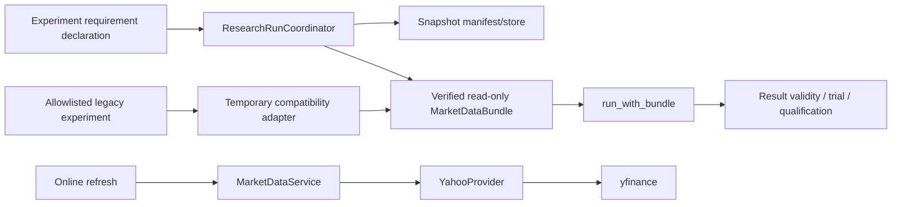

# Phase 9 實作前報告

> 本文件記錄 Phase 9 開始實作前、以 commit `41da32e` 為基線的只讀準備結果。後續 PR0 foundation 變更不回寫本歷史報告；目前工作樹狀態以 Git 與最新實作文件為準。

> Phase 9 的現況、evidence ledger、完成判定與後續 qualification boundary 統一維護於 [`docs/phase-9-primary-followup-migration.md`](../../phase-9-primary-followup-migration.md)；請勿從本歷史基線推論目前進度。


結論：Phase 9 不適合單一 PR。建議拆成「CI/contract foundation → followup 優先遷移 → 一般 primary-only → legacy bypass 批次 → zero-tolerance cleanup」。目前架構已具備 snapshot、bundle、result validity 與 research-run 基礎，但所有 423 個實驗仍屬 formal migration 未完成狀態；真正的初始 bypass 基線是 114 個檔案，而不只是 101 個直接 yfinance 檔案。

本次僅執行唯讀盤點。沒有修改程式碼、測試、文件、workflow、results 或 `pm/`，沒有下載資料、執行 backtest/research run、commit、push 或建立 PR。

## 1. Git 與 Phase 8 基線

| 項目 | 結果 |
|---|---|
| 分支 | `codex/experiment-data-access-migration-phase-9` |
| HEAD | `41da32ef7f6b2eda5af9fd7bc05b1261a2259294` |
| 最新 `origin/main` | 同為 `41da32ef7f6b2eda5af9fd7bc05b1261a2259294` |
| ahead / behind | `0 / 0` |
| merge-base | `41da32ef7f6b2eda5af9fd7bc05b1261a2259294` |
| Phase 8 commit | `4c8362274646f672669d6936df46b0d6059a55ce` |
| Phase 8 merge commit | `41da32e`，存在且為 `origin/main` 祖先 |
| PR #160 | merge metadata 已確認 |
| 工作樹 | 乾淨 |
| local `main` | 停在較舊的 `e53041e`，但目前分支與 `origin/main` 完全一致，不需處理 |

`git fetch origin --prune` 已成功完成；沒有 reset、rebase 或覆蓋任何使用者變更。

## 2. 精確 bypass 盤點

### 整體分類

目前共有 423 個正式實驗 package，且每個 config 都只有一個 primary ticker。

| 類別 | 檔案數 | 說明 |
|---|---:|---|
| 直接 yfinance | 101 | 全部在 `signal_detector.py` |
| 間接 DataFetcher bypass | 13 | 透過舊 DataFetcher/provider 路徑取得資料 |
| Phase 7 auxiliary adapter | 6 | 使用 `DeclaredAuxiliaryData`，沒有直接 yfinance |
| 一般 primary-only legacy | 303 | 走 `BaseStrategy` / DataFetcher 相容路徑 |
| 合計 | 423 | 分類互斥 |

形式化 migration 現況：

- 0 個實驗實作 `run_with_bundle`。
- 0 個實驗實作正式 definition/trial declaration seam。
- `trial_registry.json` 中 423 個 trial 全為 `legacy=True` 且 `selection_history_incomplete=True`。
- repository 中有 429 個 `latest.json`，但沒有 `*.snapshot.json`。
- 沒有可見的 qualification/lifecycle registry，因此無法從目前 repository state 精確辨認 Shadow candidates；不能憑猜測排序。

### 直接 yfinance

精確結果：

- 101 個檔案。
- 101 個 `import yfinance as yf`。
- 101 個 `yf.download(...)`。
- 每檔一個 import、一個 call site。
- 沒有 `from yfinance ...`、`yf.Ticker`、其他 yfinance API 或動態 import。
- 101 個呼叫都只有 `start`、`auto_adjust`、`progress` 類參數，沒有 snapshot cutoff/end。
- 100 個檔案捕捉廣泛的 `Exception`；多數失敗時回退為 neutral/NaN。
- 70 個檔案使用 reindex/forward-fill。
- 101 個檔案均含 MultiIndex 正規化。
- 共有 26 種 helper 名稱；最常見為 `_fetch_external` 34 個、`_fetch_reference_data` 22 個。

按 asset 計數：

| Asset | 檔案數 | Experiments |
|---|---:|---|
| CIBR | 2 | 006, 017 |
| COPX | 6 | 013, 014, 015, 016, 017, 019 |
| DIA | 5 | 009, 014, 015, 016, 018 |
| EEM | 7 | 006, 016, 017, 018, 019, 020, 022 |
| EWJ | 3 | 004, 006, 007 |
| EWT | 4 | 007, 010, 011, 012 |
| EWZ | 4 | 005, 008, 009, 010 |
| FCX | 3 | 006, 015, 016 |
| FXI | 4 | 007, 015, 016, 017 |
| GLD | 2 | 015, 017 |
| INDA | 5 | 007, 012, 013, 014, 015 |
| IWM | 1 | 009 |
| NVDA | 6 | 006, 008, 014, 015, 018, 021 |
| SIVR | 3 | 009, 019, 020 |
| SOXL | 2 | 010, 011 |
| SPY | 1 | 003 |
| TLT | 6 | 008, 009, 013, 014, 015, 016 |
| TQQQ | 7 | 019, 020, 021, 022, 023, 026, 027 |
| TSLA | 3 | 018, 019, 020 |
| TSM | 15 | 007–009、011–022 |
| URA | 1 | 006 |
| USO | 4 | 025–028 |
| VGK | 1 | 009 |
| XBI | 4 | 008, 017, 019, 020 |
| XLU | 2 | 013, 014 |

### Auxiliary symbols

101 個直接 yfinance 實驗共有：

- 128 個 auxiliary symbol 使用項。
- 35 個 distinct symbols。
- 76 個單 auxiliary、23 個雙 auxiliary、2 個三 auxiliary。

主要分布：

- `^VIX` 19
- `SMH` 16
- `SPY` 13
- `QQQ` 11
- `EEM` 11
- `^MOVE` 8
- `DX-Y.NYB`、`^TNX`、`^OVX` 各 4
- `^GVZ`、`UUP`、`SOXX` 各 3
- `^TYX`、`FXI`、`ASHR`、`CNY=X`、`^VXN`、`XLE` 各 2
- 單次：`XLB`、`HG=F`、`IWM`、`EFA`、`JPY=X`、`BRL=X`、`COPX`、`GLD`、`IEF`、`HYG`、`SQQQ`、`NVDA`、`AAPL`、`^VIX3M`、`EURUSD=X`、`IBB`、`XLV`

### 13 個間接 DataFetcher bypass

這些檔案沒有直接 import yfinance，但會自行建構 DataFetcher 並呼叫 `fetch_all`：

- `dia_019`：QQQ
- `iwm_015`：QQQ
- `nvda_016`：SMH
- `tqqq_004`：^VIX
- `tqqq_005`：^VIX
- `tqqq_007`：QQQ
- `tqqq_012`：QQQ
- `tqqq_014`：^VIX
- `tqqq_015`：QQQ
- `xbi_016`：SPY
- `xlu_005`：TLT
- `xlu_006`：TLT
- `xlu_007`：SPY

因此 Phase 9 的安全初始 allowlist 應是 114 個 typed entries，而非 101。

建議 canonical 表示為：

```text
direct-yfinance<TAB>repo-relative-posix-path<LF>
indirect-datafetcher<TAB>repo-relative-posix-path<LF>
```

以目前唯讀盤點生成的 114-entry canonical payload：

```text
SHA-256 925b666fe6b83124e597d7bfdc754d833ba0228a12e443d7a7f328106c87a845
```

此 digest 尚未寫入任何檔案。

### Phase 7 auxiliary adapter

目前 followup 中有 6 個已移除直接 yfinance、但仍使用平行 adapter 的實驗：

- `gld_016`：`^GVZ`, `DX-Y.NYB`
- `nvda_007`：`SMH`
- `tlt_017`：`^MOVE`, `SPY`, `^TYX`, `^TNX`
- `tqqq_025`：`^VXN`, `^VIX`, `^VVIX`
- `tsla_017`：`QQQ`
- `xbi_018`：`^VIX`, `XLV`

這些不應列入 yfinance bypass allowlist，但仍屬 formal migration 工作。

### Experiments 以外

合法 runtime yfinance boundary 只有：

- [provider.py](/Users/william/gitRepo/trading-2026-1/src/trading/market_data/provider.py)

沒有發現其他非預期 runtime yfinance 呼叫。

但兩份 authoring 指令仍示範直接 yfinance，新實驗可能因此重新引入 bypass：

- `.agents/skills/trading-launch-new-asset/SKILL.md`
- `.claude/commands/launch-new-asset.md`

它們應在 Phase 9 cleanup 一併更新。

## 3. 現有架構與 compatibility boundary



目標原則是：只有 `YahooProvider` 能接觸 network/yfinance；實驗、detector、strategy 與 offline coordinator 都不能取得 provider/service/cache。

現有重要邊界：

- `MarketDataService` 已能解析 requirement、cache 與 provider。
- `MarketDataBundle` 已檢查 missing/undeclared/duplicate，並以 defensive copy 防止共享資料被修改。
- snapshot manifest、blob 驗證、offline store 與 publication mode 已存在。
- `ResearchRunCoordinator` 可在 verified snapshot 上執行 runner。
- result schema 3 已把 data identity、definition identity 與 validity 串接。
- `DataFetcher`、`MarketDataReader` 與 `BaseStrategy.run` 是主要 legacy compatibility path。
- `DeclaredAuxiliaryData` / `FollowupDataBundle` 是 Phase 7 平行 auxiliary adapter。
- CLI `--legacy` 是 legacy execution boundary。
- 現有 Phase 7 parity utility 已比較 indicators/signals/trades，但 signal 使用 `Counter`，會忽略順序；Phase 9 應加強。

現有 CI 問題：

- `.github/workflows/lint.yml` 只有 Ruff，沒有 pytest 或 bypass enforcement。
- TQQQ workflow 執行 `trading run` 時沒有 `--legacy`，與目前所有實驗尚未 formal migration 的狀態衝突。
- followup workflow 的 hardcoded strategy summary 已落後目前 26 個 `STRATEGIES`。

## 4. 建議 domain model

使用 domain-modeling skill 後，建議採以下明確語意：

- **Snapshot-aware experiment**：執行前完整宣告 primary/auxiliary requirements、availability policies 與 trial metadata；只透過 `run_with_bundle` 讀取 verified immutable snapshot。
- **Legacy/unmigrated experiment**：缺少任一正式 seam，或仍在 active allowlist；只能透過明確 legacy historical/ephemeral path 執行，不可產生新 valid/qualified/live BUY 證據。
- **Market-data requirement**：series identity、角色、期間、calendar/coverage、availability policy 的完整宣告。
- **Primary series**：被交易且定義 decision sessions/cutoff 的唯一主要序列。
- **Auxiliary series**：只供條件、regime 或相對指標使用，必須按資訊可得時間對齊。
- **Availability policy**：publication lag、最大 forward-fill lag、decision-time/as-of 規則。
- **Read-only bundle**：只能讀取已宣告且驗證的資料；呼叫者修改回傳 frame 不得改變 bundle。
- **Provider boundary**：唯一允許 network/yfinance 的 production module。
- **Direct bypass**：任何由 experiment 內部啟動的資料取得，不限於文字上的 `yf.download`；包含 alias、wrapper、dynamic import、DataFetcher、service/provider/cache construction。
- **Legacy allowlist**：具 finding kind、canonical path、基線 commit 的暫時例外集合。
- **Monotonic shrink**：新集合只能是 PR base 集合的真子集或相同集合；不得新增、改名規避或保留 stale entry。
- **Migration unit**：同 asset 或共享 detector/data pattern、共用一份 immutable snapshot 與 parity evidence 的小批次。
- **Identical-snapshot parity**：舊、新 runner 只能看到同一 verified blob set。
- **Indicator/signal/fill/trade parity**：各層分別 canonicalize 並精確比對，不能只比較最終績效。
- **Documented correction**：有唯一 diff ID、原因、資料政策變更與證據，且觸發新 definition/trial/requalification。
- **Offline replay**：只讀 manifest/blob/definition；provider 與 network 呼叫數必須為零，也不能寫入 `latest.json`。
- **Zero-tolerance state**：experiment tree 零 bypass、active allowlist 不存在、legacy data-access adapter 已移除。
- **Compatibility adapter removal**：移除 DataFetcher/MarketDataReader 舊執行路徑、Phase 7 auxiliary adapter，以及無用的 legacy execution path；保留舊 result 的讀取能力。

## 5. 建議 requirement/bundle contract

建議 experiment 提供 side-effect-free 的 class/module-level contract：

```python
market_data_requirements() -> tuple[MarketDataRequirement, ...]
run_with_bundle(bundle: MarketDataBundle, context: ResearchRunContext) -> Result
```

必要規則：

1. Discovery 先解析 requirements，不建構 provider、不讀資料。
2. 恰好一個 primary；零到多個 auxiliary。
3. 相同 series 的重複相同宣告可正規化；衝突 policy 立即失敗。
4. manifest requirement set 必須與實際 bundle key set 完全一致。
5. bundle access 記錄實際使用的 keys；未宣告 access 立即失敗。
6. offline runner 永遠沒有 provider/service/cache capability。
7. migrated experiment 不得回退至 compatibility path。
8. requirement/policy 的 canonical form 必須進入 definition fingerprint。

目前 `MarketDataBundle` 有一個阻塞性缺口：auxiliary 只對 manifest decision time 產生單一 aligned row。歷史 backtest 需要對 primary 的每個 decision session 產生完整、可審計的 as-of time series。此 contract 必須在第一個 auxiliary migration 前完成。

另一個重大缺口是 cache/validation 對所有 series 強制使用 XNYS 完整 session coverage。但現有 auxiliary 包含 FX、期貨、利率及波動率指數，例如 `EURUSD=X`、`JPY=X`、`HG=F`、`^MOVE`。建議分離：

- primary decision calendar：XNYS。
- series observation calendar/coverage policy：依資料系列宣告。
- availability alignment：將 observation publication time 映射至 XNYS decision sessions。
- 未知 publication timing：依 ADR 0031 至少 lag 1 session，fail closed。
- 已有明確證據者才可使用 lag 0。

## 6. Allowlist 與 CI enforcement

建議暫時新增：

- `ci/market-data-bypass-baseline.json`
- `ci/market-data-bypass-allowlist.json`
- `tools/check_experiment_market_data_access.py`
- `tests/test_experiment_market_data_policy.py`

初始 baseline 綁定：

- commit `41da32ef...`
- 101 個 `direct-yfinance`
- 13 個 `indirect-datafetcher`
- canonical digest `925b666f...`

CI 應驗證：

- AST import、from-import、alias、attribute call。
- `yf.download`、`Ticker` 及所有其他 yfinance API。
- literal `__import__` / `importlib.import_module`。
- DataFetcher、MarketDataService、YahooProvider、cache/provider construction。
- `src/trading` 中只有 `market_data/provider.py` 可 import yfinance。
- path 必須是 repo-relative POSIX、normalized、非 symlink escape。
- duplicate、不存在、finding kind 不符、stale entry 均失敗。
- current findings 必須恰好等於 active allowlist。
- active allowlist 必須是 PR base/merge-base allowlist 的子集。
- 改名後的新路徑不在 baseline，CI 失敗；舊路徑則成為 stale entry，也失敗。
- arbitrary computed dynamic import 無法完全靠 AST 證明，需另以 offline zero-network integration test 補足。

當 allowlist 歸零時：

1. active allowlist 先變為空。
2. 全套 zero-tolerance test 通過。
3. 移除 active/baseline migration files及 compatibility code。
4. CI 切換為直接要求 scanner findings 為空。
5. Git history 保留遷移過程，不需在最終 tree 保留 allowlist。

## 7. Fixed-snapshot parity

舊、新實作不得各自下載資料。建議：

1. 建立一次 verified immutable snapshot。
2. migrated runner 直接使用正式 bundle。
3. legacy runner 透過只限 parity 的 adapter 讀取同一 bundle；攔截舊 `yf.download`/DataFetcher 語意，但完全不接觸 Yahoo。
4. 在同一 Python/dependency environment 執行。
5. 保存以下分層 digest 與 diff：

| 層級 | 建議精度 |
|---|---|
| Market bars | canonical float64，parser-stable `%.15g`、index/column/dtype/order 全部一致 |
| Indicators | 同環境下 exact canonical equality；NaN position equal |
| Signal dates | ordered identity + XNYS date，不能使用會忽略順序的 Counter |
| Fills/trades | canonical JSON fields、日期、side、quantity、price 完全一致 |
| Money/cost/order fields | 由字串建構 Decimal，使用明確 scale，Decimal-exact |
| Timestamps | timezone-aware UTC instant；不得使用 naive timestamp |
| Availability | 整數 session lag及明確 publication/as-of timestamp |

不建議 blanket tolerance。若底層 library 確有平台差異，應針對具名欄位制定有來源的 tolerance，而非降低整體 gate。

Parity evidence 建議保存為 result-linked、不可變的 metadata，例如：

```text
results/<experiment>/<snapshot-id>.migration-parity.json
```

內容包含 snapshot ID、舊/新 definition reference、runtime/dependency identity、各層 checksums、diff IDs、correction evidence 與最終 pass/fail。不得把 market-data blobs 或個人交易資料放入 Git。

## 8. Result identity、trial 與 qualification

保守結論：

- **source-only migration 仍會改變 definition fingerprint。**
- 現有 fingerprint 包含 strategy/detector/backtester normalized AST；改成 bundle access 後 source identity 會變。
- parity 成立只證明在該 snapshot 上行為一致，**不能免除新 trial 或 qualification**。
- requirement、availability policy 與 alignment contract 也屬 outcome-relevant definition，應進入新版 fingerprint schema。
- non-parity correction 無論被稱為 bug fix、corporate-action fix 或 data-consistency correction，只要改變 indicators/signals/fills/trades，就必須：
  - 產生 correction evidence；
  - 新 definition fingerprint；
  - 新 trial；
  - 重新 qualification；
  - 不得沿用舊 Shadow/Healthy 狀態。
- migration batch 不得覆寫既有 legacy result、`latest.json`、qualification 或 lifecycle。
- offline/historical migration evidence只能寫 immutable historical artifact；不得 advance latest。
- legacy result reader應保留，不能把舊結果重新解釋為 schema 3 valid result。

目前 `refresh_candidate_snapshot` 會複製舊 manifest requirements。若實驗新宣告了 auxiliary，這會漏抓新依賴；應改為以目前 experiment declaration 為準並對差異 fail closed。

## 9. 建議 migration batches

### PR 0：CI 與 contract foundation

- AST scanner、114-entry baseline/allowlist。
- 正式 experiment requirement seam。
- historical auxiliary bundle access。
- per-series calendar/coverage model。
- requirement/policy fingerprint。
- offline zero-network guard。
- parity evidence schema。
- 不遷移任何 production experiment。

### PR 1：單一 primary-only tracer

先遷移 current followup 的 `spy_007`：

- 最簡單 primary-only。
- 驗證 end-to-end declaration、snapshot、bundle、parity、new trial 與 publication boundary。
- 不進行 live cutover。

### PR 2：其餘 19 個 current followup primary-only

- `cibr_014`, `copx_007`, `dia_013`, `eem_012`, `ewj_002`
- `ewt_001`, `ewz_006`, `fcx_008`, `fxi_005`, `inda_010`
- `iwm_006`, `sivr_006`, `soxl_005`, `tsm_006`, `ura_003`
- `uso_009`, `vgk_007`, `voo_003`, `xlu_002`

### PR 3：current followup auxiliary

按複雜度拆分：

- 單 auxiliary：`nvda_007`, `tsla_017`
- 雙 auxiliary：`gld_016`, `xbi_018`
- 三 auxiliary：`tqqq_025`
- 四 auxiliary及利率資料：`tlt_017`

完成後移除這 6 個實驗對 `DeclaredAuxiliaryData` 的依賴，但尚不刪整個 adapter。

### PR 4 起：其餘 283 個 primary-only

以 native `BaseStrategy.run_with_bundle` 共用實作降低重複修改，但按 asset PR 啟用與驗證。不要一次替 283 個 experiment 靜默更新 result/trial。

### 間接 DataFetcher 批次

建議先處理相同 pattern：

- TQQQ：004, 005, 007, 012, 014, 015
- XLU：005, 006, 007
- 其他：DIA019, IWM015, NVDA016, XBI016

### 直接 yfinance 五個 asset waves

1. 半導體／台灣：EWT 4、TSM 15、NVDA 6、SOXL 2，共 27。
2. 中國／新興市場：EEM 7、FXI 4、INDA 5、EWZ 4、EWJ 3，共 23。
3. 指數／利率／波動：TLT 6、TQQQ 7、XLU 2、DIA 5、IWM 1、SPY 1，共 22。
4. 商品：COPX 6、FCX 3、GLD 2、SIVR 3、URA 1、USO 4，共 19。
5. 其餘 sector/global：CIBR 2、TSLA 3、VGK 1、XBI 4，共 10。

每個 wave 仍應拆為 asset-sized PR，並先做單一 liquid auxiliary，再做 multi-aux，最後處理 FX、期貨、利率與 volatility indices。

### Final cleanup PR

- active allowlist 為空。
- experiment tree 零 yfinance/DataFetcher bypass。
- 移除 DataFetcher/MarketDataReader data-access compatibility。
- 將 followup 全面切至正式 MarketDataBundle，移除 Phase 7 adapter。
- 評估並移除 CLI legacy execution path；保留 legacy result read support。
- 更新 authoring skill、CLAUDE command及 workflows。
- CI 切換為 zero tolerance。

Shadow candidates 原則上應與 followup 同等優先，但目前沒有 registry 可識別它們；實作前若 registry 出現，應動態插入 PR 1–3，不應硬編一份推測名單。

## 10. Acceptance gate 對照

| Gate | 證據 |
|---|---|
| 零 direct yfinance | AST scanner findings = 0 |
| Provider 唯一 network boundary | module policy test + import scan |
| 完整 requirements | declaration、manifest、bundle keys 三者相等 |
| Undeclared/missing fail closed | bundle及runner integration tests |
| Auxiliary 正確 as-of | calendar/publication-lag table tests |
| Offline 零 network | monkeypatched provider/yfinance/socket 呼叫數為 0 |
| Bundle read-only | mutation不影響後續讀取 |
| Identical-snapshot parity | indicators/signals/fills/trades 分層 evidence |
| 合法 correction | diff ID、理由、data policy、fingerprint/trial gate |
| Result protection | historical/offline 不改 `latest.json` |
| Migrated 不走 adapter | runtime path assertion + static dependency check |
| 未遷移仍可相容 | allowlisted legacy regression test |
| Allowlist 單調縮小 | PR base set comparison |
| Zero-tolerance cleanup | empty findings、adapter modules不存在 |
| 無 live cutover | qualification/lifecycle及BUY suppression仍維持 Phase 8 contract |

## 11. TDD red-green-refactor 順序

使用 tdd skill 後，建議先確認公開 seams，再以垂直切片進行；每片先一個 failing test、最小 green，數個 coherent slices 後再做獨立 review/refactor checkpoint。

1. 禁止一種 `import yfinance` → 最小 AST scanner。
2. 逐一加入 from-import、alias、API call、dynamic literal import。
3. canonical allowlist path、kind、duplicate、stale、不存在、symlink escape。
4. PR base allowlist monotonic shrink與 renamed bypass。
5. primary-only requirement declaration與重複/conflicting policy。
6. missing及 undeclared bundle access fail closed。
7. read-only mutation防護。
8. provider-only boundary與 migrated experiment adapter-path prohibition。
9. offline replay monkeypatch network/yfinance/provider，驗證零呼叫。
10. historical auxiliary alignment、publication lag、max staleness、calendar edge cases。
11. identical-snapshot indicator parity。
12. ordered signal-date parity。
13. fill/trade Decimal/timestamp parity。
14. documented correction evidence gate。
15. definition fingerprint改變、新 trial及重新 qualification。
16. CLI online/offline/legacy boundaries。
17. online/offline/ephemeral result publication及 `latest.json` protection。
18. 批次期間未遷移 experiment 相容性。
19. active allowlist清空。
20. compatibility adapter實際刪除與整個 experiments tree零 bypass。

## 12. 規格歧義與保守判定

已可依現有 contract 解決：

- parity 不免除新 trial/requalification。
- provider.py 是唯一合法 yfinance boundary。
- direct yfinance 應擴張為所有 experiment-initiated data bypass。
- 既有 legacy results 不得重寫或重新認定有效。
- 大量 migration 必須拆多 PR。
- accepted correction 不是 qualification continuity 豁免。

仍有重大設計缺口：

1. `MarketDataSeries` 是否加入 observation calendar/coverage identity。
2. auxiliary historical bundle 的正式 accessor 與 alignment audit shape。
3. unknown publication timing 的預設 policy；建議至少 lag 1。
4. parity evidence 的正式路徑與 schema ownership。
5. definition fingerprint schema 是否顯式加入 canonical requirements/policies；建議必須加入。
6. source dependency closure如何涵蓋 inherited/imported strategy helpers。
7. final compatibility removal是否包含整個 CLI `--legacy`；建議移除執行能力，但保留 legacy result reader。
8. 303 個 primary-only實驗採 inherited declaration還是每 package 顯式 metadata；建議使用可靜態解析的共用 schema，但產生逐實驗 canonical declaration。
9. TDD 公開 seams需在開始寫第一個 failing test前確認。

## 開始實作前建議確認的決定

我的建議預設值是：

- 採雙 allowlist檔案與 114-entry typed baseline。
- 先做 PR 0 foundation，再以 `spy_007` 為 tracer。
- requirement及availability policy納入新版 definition fingerprint。
- primary維持 XNYS；auxiliary加入 series-specific observation calendar/coverage。
- unknown publication timing預設 lag 1 session。
- parity使用 exact canonical comparison，不設全域 tolerance。
- parity成立仍建立新 trial並重新 qualification。
- cleanup刪除所有 data-access adapters及 legacy execution，但保留 legacy result read compatibility。
- 每個 asset/family獨立 PR，不批次更新任何 persisted result或 lifecycle state。

報告基線結論：工作樹在報告產生時乾淨，HEAD 與當時最新 `origin/main` 完全一致。本文件完成後才開始 Phase 9 PR0 foundation。
