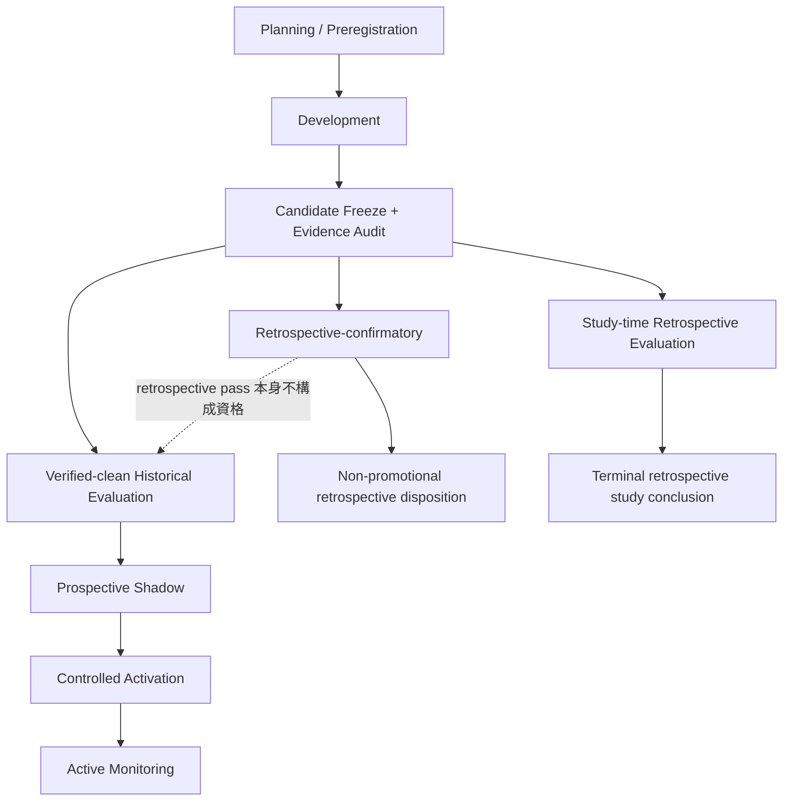

# Research Evidence Stages and Outcomes

## 文件定位

本文件用白話說明 `strategy-forward-replication-research` 中各研究階段的目的、順序、資料
角色、可能 outcome，以及每次通過實際授予的權限。它是 explanatory guide，不是獨立的
normative contract；正式執行仍以 study pin 的 released `WORKFLOW.md`、policy releases、
preregistered `HYPOTHESIS.md` 與 `PLAN.md` 為準。

本文件是 `strategy-forward-replication-research@v008` 的 version companion，同時包含精簡
白話版與完整版。它本身沒有執行或晉級權限；v008 是否可建立新 study 永遠由 root
`workflows/README.md` lifecycle registry 決定：draft 無 authority，active 才可建立新 study，
superseded／retired 後不可建立新 study。Released companion 的 exact bytes 會被 pin，但唯一
behavioral authority 仍是同目錄的 `WORKFLOW.md`。

## 精簡白話版（先看這裡）

### 一句話理解整個流程

先用資料找出策略，再依 route 用另一段資料考它。考過後只取得該 route 的局部結論或
下一階段資格；只有 verified-clean Historical `pass` 才能進 Shadow。最後仍須經人工控制與
風險保護才可能啟用，任何 `pass` 都不代表可以直接實盤。

### 主要階段與兩種 retrospective 路徑

| 階段 | 白話意思 | 通過後可以做什麼 |
|---|---|---|
| Development | 用已知歷史資料試想法、比較 trials、選出一個 candidate | 把 candidate 和全部規則鎖定，準備接受真正考試 |
| Retrospective-confirmatory | 對已完成但 provenance 不乾淨的歷史區間做 checkpoint；其 Development context 可能比 Evaluation 更晚 | 只記錄 non-promotional retrospective disposition |
| Study-time Retrospective Evaluation | 從現有歷史中預留較晚期間，強制較早 Development、較晚 Evaluation；先鎖規則再考試 | 可以完成「歷史上是否站得住腳」的 terminal study，但不能直接進 Shadow |
| Verified-clean Historical Evaluation | 用能證明未曾影響設計與選擇的乾淨資料考試 | 得到 `shadow-eligible`，可以開始 prospective paper validation |
| Prospective Shadow | 從註冊當下開始，向未來累積紙上訊號與模擬成交 | 得到 `activation-eligible`，可以接受啟用前檢查 |
| Controlled Activation | 人工確認帳務、broker reconciliation、allocation、parity 與 risk guards | 所有 guards 都有效時，才可能進入 Active |
| Active Monitoring | 啟用後持續檢查資料、執行、績效與風險是否漂移 | 維持 `Healthy`、提高警戒到 `Watch`，或停止新進場成為 `Paused` |

最容易混淆的是三種 Evaluation：

- Retrospective-confirmatory 允許 nonstandard chronology；較晚的已知資料可以是
  Development context，不能假設 Development 一定早於 Evaluation。
- Study-time retrospective 強制較早 Development、較晚 Evaluation，所以可以在當下
  完成一個 time-ordered historical study；但 pass 只能說 `retrospectively-supported`。
- Clean Historical Evaluation 重點不是資料夠舊，而是能證明它在 freeze 前沒有影響研究；
  只有這種 pass 才能取得 `shadow-eligible`。

### 四種 outcome

| Outcome | 最白話的解釋 |
|---|---|
| `pass` | 這一關完整通過；只取得明定的局部 disposition 或下一階段資格 |
| `fail` | 證據完整、可以判斷，但至少一個必要標準沒有達到 |
| `insufficient-evidence` | 規則沒壞，只是未來資料、時間或成交筆數還不夠；主要用在 Shadow 等持續累積階段 |
| `indeterminate` | 不是表現好壞問題，而是資料、identity、approval 或 evidence 不足以讓結論可信 |

### 最重要的三條界線

1. Development 做得很好，不等於 Evaluation 通過。
2. Retrospective pass 不等於 clean Historical pass，也不能直接進 Shadow。
3. Shadow pass 也不等於自動實盤；還要通過人工 activation 與所有安全 guards。

### 要不要等未來？

- 如果目的只是判斷「這個策略在歷史上是否值得保留」，study-time route 可用 Development 加
  time-ordered Retrospective Evaluation，在 study 當下完成研究結論。
- 如果目的包含 Shadow、activation 或 live authority，仍需要 verified-clean Historical 與
  真正向前累積的 Shadow evidence，不能用回測取代。
- 上述 route 只有在 v008 為 root-registry active version 時才可供新 study 選用。

## 完整版（詳細說明）

### 核心原則

研究流程不是一次總分判定，而是一連串權限逐步增加的 gate：每一階段只回答一個較窄的
問題，`pass` 也只產生該 decision point 明定的局部 disposition 或下一階段資格。

1. 每個交易 session 在同一研究輪只能有一個資料角色。
2. 曾影響設計、選擇、門檻或解讀的資料只能作 Development，不得再宣稱為 validation。
3. Evaluation 的資料區間、trial family、candidate、baseline、成本、執行規則、metrics 與
   thresholds 必須在查看該 Evaluation outcome 前凍結。
4. Evaluation outcome 一旦被查看，該資料就已被本輪使用；修改策略後不得重用同一資料證明
   修改有效。
5. `pass` 不是獲利保證，也不是自動或真實交易授權。
6. Evidence、identity 或 replay 不完整時，必須是 `indeterminate`，不能以人工判斷取代。

### 階段順序

圖中的 retrospective 與 clean Historical 是不同證據角色。所有路徑都要先 freeze 再看各自
Evaluation；但只有 study-time route 強制 Development 早於 retrospective Evaluation。
Retrospective-confirmatory 可採 nonstandard chronology。只有能證明未被設計或
選擇污染的 clean Historical 才能授予 `shadow-eligible`。

#### Promotion 路徑與 Retrospective-confirmatory

Promotion route 可在 Candidate Freeze 後加入 optional retrospective-confirmatory checkpoint，再走
clean Historical、Shadow、Controlled Activation 與 Active Monitoring。Retrospective pass
只記錄研究支持，不替代 clean Historical。其 explicit role calendar 可把較早 completed
Evaluation 與較晚 Development context 分開；因此不能套用「Development 一定先發生」的
study-time chronology。

#### Study-time retrospective terminal 路徑

為了讓每個 study 不必等待未來年份才完成研究判定，study-time route 允許在 study 建立時把當下已存在的
歷史資料預先切成：

- 較早且可供設計與選擇的 `Development`；
- 較晚、依時間排序、在 preregistration 與 candidate freeze 後才執行的
  `time-ordered retrospective Evaluation`。

這條路徑可以完成一個 terminal study conclusion，但預設只能產生 retrospective research
evidence。若未來需要 Shadow 或 activation，應另以未使用且可驗證 clean 的資料建立 successor
study。Version 是否可初始化此 route 只依 root lifecycle registry 判定。

### 各階段的意義

| 階段 | 使用的資料 | 回答的問題 | 通過後得到什麼 | 不代表什麼 |
|---|---|---|---|---|
| Planning / Preregistration | 不查看預定 Evaluation outcome | 問題、trial budget、資料角色、選擇規則、gates 與停止規則是否已完整凍結？ | 可以依 frozen plan 開始受治理研究 | 不代表策略有效 |
| Development | 已知、已看過或明確分配給設計的歷史資料 | 在 trial budget 內能否找到符合 Development gates 的單一 candidate？ | 可以 freeze candidate 並進入指定 Evaluation | 不代表 out-of-sample 支持 |
| Candidate Freeze / Evidence Audit | Identity、source bytes、registry 與 provenance；不新增 Evaluation outcome | Candidate、baseline、完整 family、成本、規則及 Evaluation classification 是否可重現？ | 建立不可事後調整的選擇邊界 | 不代表任何 performance gate 通過 |
| Retrospective-confirmatory | 已完成、provenance 不乾淨且可採 nonstandard chronology 的歷史資料 | Frozen checkpoint 是否通過 retrospective screen？ | Non-promotional `retrospectively-supported` 或失敗／不確定 disposition | 不授予 `shadow-eligible`、activation 或 live authority |
| Study-time Retrospective Evaluation | 當下已存在、依時間置於 Development 之後，但 clean provenance 不足的歷史資料 | Frozen candidate 在較晚歷史時段是否仍通過預設 benchmarks、robustness 與 selection adjustment？ | Terminal `retrospectively-supported`，或一個完整的否證／不確定結論 | 不授予 `shadow-eligible`、activation 或 live authority |
| Verified-clean Historical Evaluation | 能證明在 freeze 前未影響設計、選擇或門檻的 Evaluation 資料 | Candidate 是否在完整 clean folds 與全部 challenges 下通過？ | `shadow-eligible` | 不代表 Shadow 已通過或可實盤 |
| Prospective Shadow | Registration 後才出現的 paper proposals 與 simulated fills | Frozen definition 在真正 prospective 條件下是否持續符合 gates？ | `activation-eligible` | 不等於 Active，也不開啟 new BUY |
| Controlled Activation | Exact Shadow evidence、parity、ledger、reconciliation、allocation 與 risk guards | Operator 是否可在受控邊界內啟用？ | 在所有 guards 仍通過時進入 Active | 不取消 no-new-entry，也不保證未來獲利 |
| Active Monitoring | 啟用後 append-only observations、fills、drift 與 integrity evidence | 現有 authority 是否仍應維持、觀察或暫停？ | `Healthy`、`Watch`、`Paused` 與受治理 recovery | 不允許忽略 hard guard 或刪改歷史 |

### Development

Development 是設計與選擇空間，不是 validation。它可以包含：

- 已被研究者看過的歷史結果；
- legacy studies 與先前失敗、成功或 indeterminate 的 Evaluation；
- 用來選參數、特徵、baseline、成本模型或 thresholds 的資料；
- 任何 selection history 不完整、但仍可誠實標示為設計背景的資料。

Development 必須保留完整 trial history，包含失敗、移除、tombstone 與 rerun。若某個 candidate
在 trial budget 內無法通過 Development gates，通常是 `fail`；不得一直增加 trial 或只保留
winner。若資料、definition、policy 或 registry identity 無法驗證，則是 `indeterminate`。

### Retrospective-confirmatory

Retrospective-confirmatory 是 optional checkpoint，主要處理已完成、但無法證明
clean provenance 的舊 Evaluation。它允許 explicit nonstandard role calendar；例如較早年份是
retrospective Evaluation，而較晚、已影響設計的資料是 Development context。兩者仍須完全
分離，但 Development 不一定在日曆上早於 Evaluation。

Pass 只產生 `retrospectively-supported`，不能成為 Shadow registration source。這條路徑
與下一節 terminal study-time route 不可由日期推測或在 persistence/reload 時互換。

### Time-ordered Study-time Retrospective Evaluation

Time-ordered 表示 Development 一定早於 Evaluation，而且 fold、warmup、embargo、purge 與
boundary 在 outcome inspection 前已凍結。Retrospective 表示資料在 study 當下已存在，且不能
充分證明它從未影響過設計或 selection。

這個階段仍比單純 Development 強，因為 candidate freeze 後禁止調參，並以固定 baseline、
cash、random entries、完整 family selection adjustment、cost/fill stress 與 robustness challenges
評估。但它沒有解決所有研究者自由度與 prior exposure，因此 pass 只能解讀為
`retrospectively-supported`。

這條 route 不降低既有 floors：至少三個完整 Development 年、五個完整連續 annual
retrospective folds、20 筆 completed trades、三個 traded folds、60% positive traded folds，
base/stress return 與 profit-factor floors、study 預註冊的 stress-drawdown 上限、50% fold
concentration 上限，以及至少 90% family-wise selection confidence。Cash、distinct baseline、
random entries、parameter、execution、cost/fill、missed-entry 與 regime challenges 仍為必需；
baseline margins、binding requirements 與其他 hypothesis-specific gates 由個別 study 在 outcome
前預註冊，只能加嚴，不能冒充通用數值 floor。Calendar 不足三年加五 folds 時不得
preregister 此 route；執行後交易或 traded-fold 數不足是 `fail`，不是
`insufficient-evidence`。

在 v008 中，這些約束不是只寫在敘述文字裡。Release 必須宣告
`study-time-retrospective-v1` capability；每個 v008 route study 在 preregistration 時固定並 pin
`QUALIFICATION_SPEC.json`，其中包含完整 family、whole-year calendar 與 warmup bounds、trial budget、source identities、
authoritative trial/qualification registry identities、全部 required challenges 與逐 study typed
gates。Planner 以 pinned session policy deterministic derive exact session inventories，再由 plan
凍結；spec 不虛稱預先列出 exact sessions。Development 必須另有 add-only human stage
authorization，candidate freeze 也必須保存 stable human approval/scope 並再次 pin 同一份 spec。
Candidate freeze 只能由 guarded current-time `workflow study freeze-candidate` writer，從只含
selected candidate、distinct baseline 與 ordered complete family 的 Development selection
建立；caller 不能帶入 approval time、scope、identity、digest 或 budget，也不能覆寫既有 freeze。
Planner 的 public route 只接受 exact study path，不能讓 caller 另傳一套 family、日期或門檻。

Terminal `pass` 或 retrospective `fail` 也不能只靠 README 的 outcome/disposition 組合。
`TERMINAL_EVIDENCE.json` 必須連到同一 study 的 preregistration、qualification spec、Development
authorization、candidate
freeze、由 registry 與 head checkpoint 封裝的 tracked content-addressed qualification evidence、
exact plan、exact screen，以及完整 challenge manifest；該 snapshot 必須經正式 registry
hash-chain/checkpoint reader 重播，而不是把任意 JSON 當作 registry；
`pass` 要求 screen 與每個 challenge gate 都是 passing。Development `fail` 則必須連到完整、
可信且明確沒有 eligible candidate 的 Development gate，以及 preregistration 所凍結 registry
的 content-addressed absence snapshot；正式 completion 時該 snapshot 必須等於當下 registry
head，且不得含該 study 的 plan/screen。Completion 與 plan registration 共用同一把
study-registration lock；planner 進鎖後必須重讀 freeze／completion state，不能沿用鎖外舊狀態。
刪除 `CANDIDATE_FREEZE.json` 不能抹除 append-only plan history。Identity 或 evidence chain
缺損只能是 stage-identified `indeterminate`。

Study-time qualification plan 的 durable identity 也必須保留實際操作核准者、核准時間與當下
contamination declaration，以及 exact trial/qualification registry paths。Qualification snapshot
publisher 必須證明實際讀取的 registry path 等於 repository root 加上 preregistered source
identity，不能由 caller 把另一個 registry 自報成該 identity；plan 另存 exact
repository-relative registry identities，fresh-clone replay 直接比對 relative identities，
不接受 absolute-path suffix 或 copied-root lookalike。Qualification snapshot 位於
`results/qualification-evidence/<sha256>.json`；Development/challenge artifacts 位於
`results/study-evidence/**`，都必須是 Git-index exact bytes。Snapshot 會 typed-rehydrate
folds、aggregate、benchmarks、selection adjustment 和完整 14 個 shared gates，
並只接受每個 plan 唯一的 canonical `historical-screen:<plan-id>` event，
再從 frozen evidence 重算 gate。九個 required challenges 各自凍結 typed gate、target identity、
唯一 evidence identity 與不同的 immutable evidence artifact；artifact 本身提供與 metric／target
綁定的 observed value，terminal review 從該值重新計算 gate，不接受只由 manifest 提供的
`observed` 或 `passed`。

Retrospective Evaluation 不應使用 `insufficient-evidence` 來掩飾固定歷史 gate 的失敗：完整
資料未過 gate 是 `fail`；資料、identity、classification 或 required evidence 無法可信判定是
`indeterminate`。

### Verified-clean Historical Evaluation

Clean Historical 與 retrospective 最大的差異不是資料年代，而是 provenance。只有能以
append-only evidence 證明該段資料在 candidate、trial family、selection rule 與 thresholds
freeze 前未影響研究，才能標為 `verified-clean`。

通過所有 annual-fold、baseline、random、selection-adjustment、robustness、cost、execution、
concentration 與 integrity gates 後，candidate 才是 `shadow-eligible`。任一完整 gate 失敗是
`fail`；缺少 required identity 或 evidence 是 `indeterminate`。固定且已完成的 Historical
checkpoint 不使用 `insufficient-evidence`。

### Prospective Shadow

Shadow 是在通過 clean Historical 後，以當下時間註冊並從此刻向前累積的 paper evidence。
它不回填 registration 前的 session，不建立 broker fills 或 actual positions，也不呼叫 broker。

只有 Shadow 這類仍在持續累積的 open stage，才適合使用 `insufficient-evidence`：例如已達最低
等待時間，但 completed fills 尚未達門檻。此時 definition 與 gates 必須保持凍結並繼續等待，
不得降低門檻。完整 performance gate 失敗是 `fail`；identity 或 integrity 問題是
`indeterminate`。

### Outcome 與 disposition

#### 四種正式 outcome

| Outcome | 意義 | 典型後續 |
|---|---|---|
| `pass` | 所有 required identities、approvals 與該 decision point 的 frozen gates 均通過 | 只進入該 stage 明定的下一步或取得局部 disposition |
| `fail` | Evidence 完整且可判定，但至少一個必要 gate 失敗 | 本輪停止；修改後須用新 trial／study 與未使用 Evaluation |
| `insufficient-evidence` | Open prospective stage 尚未累積到預設數量或時間 | 保持 definition/gates 凍結並繼續等待；不得用於 fixed Historical gate |
| `indeterminate` | Data、identity、artifact、approval、classification 或 replay 不足以可信判定 | Fail closed；只能恢復同一 evidence，不能換資料或規則製造答案 |

#### 容易和 outcome 混淆的標籤

| 標籤 | 類型 | 精確含義 |
|---|---|---|
| `development-selection-failed` | Development disposition | 完整 Development evidence 找不到 eligible candidate，且沒有 retrospective plan/screen |
| `retrospectively-supported` | Retrospective disposition | 歷史回看 gates 通過；沒有 promotion authority |
| `retrospective-screen-failed` | Retrospective disposition | 完整 retrospective gate 失敗 |
| `shadow-eligible` | Clean Historical disposition | 允許註冊 prospective Shadow；不是 Shadow pass |
| `activation-eligible` | Shadow disposition | 可接受 Controlled Activation guards 檢查；不是 Active |
| `Healthy` / `Watch` / `Paused` | Active monitoring state | 當下 drift/integrity overlay；不是 study terminal outcome |

### Outcome 如何隨階段解讀

| Decision point | `pass` 的局部意義 | `fail` | `insufficient-evidence` | `indeterminate` |
|---|---|---|---|---|
| Development selection | Candidate 可被 freeze | `development-selection-failed`：無合格 candidate 或 trial budget 用盡 | 通常不適用 | 來源、registry、結果或 ranking 不可驗證 |
| Retrospective Evaluation | `retrospectively-supported` | 完整 retrospective gate 失敗 | 不適用於固定歷史資料 | Classification、boundary、family 或 evidence 不完整 |
| Clean Historical | `shadow-eligible` | 任一完整 clean gate 失敗 | 不適用於固定 Historical folds | Clean provenance 或 required evidence 不可驗證 |
| Shadow | `activation-eligible` | 完整 Shadow gate 失敗 | 尚缺 prospective duration/fills | Registration、prefix、definition 或 evidence integrity 失敗 |
| Controlled Activation | Operator 可在全部 guards 下啟用 | 任一 activation guard 不通過 | 通常不適用 | Exact identities、ledger、parity 或 reconciliation 不可驗證 |
| Monitoring | 維持符合當下 state 的權限 | Hard/performance guard 觸發 pause 或 termination | 尚未成熟的 scheduled checkpoint | Evidence chain 或 state integrity 不可信 |

### 一個 study-at-time 範例

假設在 2026 年建立 study，且可用歷史資料到 2025 年底。Plan 可以在任何 outcome-relevant
execution 前，先凍結例如：

- 2010-2020：Development，用於設計、trial selection 與 candidate freeze；
- 2021-2025：time-ordered retrospective Evaluation，只在 freeze 後執行；
- 2026 以後：不屬於該 retrospective study，除非另開 clean/prospective successor。

這個 study 不必等未來年份即可完成獨立 review。若 retrospective gates 全通過，結論可以是
`pass` 並記錄 `retrospectively-supported`；若 performance gate 完整失敗則是 `fail`；若 family、
provenance 或 evidence 無法驗證則是 `indeterminate`。無論哪一種，都不能直接跳到 Shadow。

### 快速判斷

- 想回答「這個想法在已知歷史上是否值得保留？」：使用 Development 加 time-ordered
  retrospective Evaluation。
- 想回答「是否可以開始 prospective paper validation？」：需要 verified-clean Historical
  `pass`，得到 `shadow-eligible`。
- 想回答「prospective behavior 是否足以接受 activation checks？」：需要 Shadow `pass`，得到
  `activation-eligible`。
- 想回答「現在是否可接受 new BUY？」：還要通過 Controlled Activation、ledger、broker
  reconciliation、parity、allocation、drift 與 no-new-entry guards；研究 pass 本身永遠不夠。
